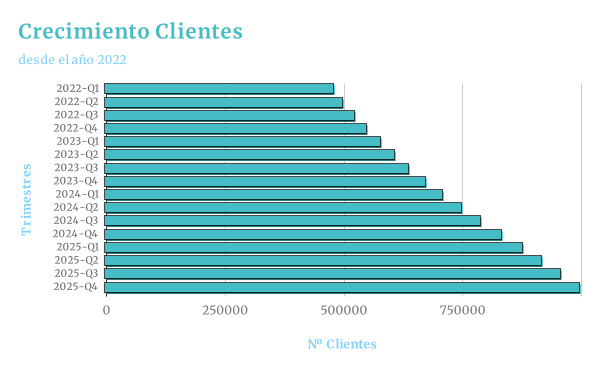
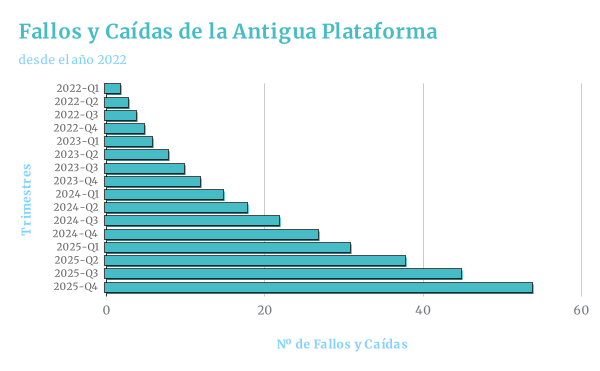

# Gestión del Grupo Sanitario Privado  SanitUS

## Miembros del grupo L4

1. Suárez Masero, Victor
1. Jiménez Bermúdez, Francisco José
1. Pérez Olivera, Marcos
1. Álvarez de la Maya, Rafael

********************************************************

| 🏥 Introducción al Problema |
| :--- |
| Nos han contactado el grupo de hospitales privados **SanitUS**, debido a su costante crecimiento su actual sistema de gestión se ha quedado obsoleto y lento. SanitUS es un grupo que opera a nivel nacional en España teniendo como centros principales **Hospitales** y **Centros Médicos** de día, en cuanto a su personal los usuarios que usaran la plataforma serían sus **médicos**, sus **enfermeros**, obviamente los **clientes** y el **personal de administración**. |

<!-- Nos han contactado de un grupo de gestión sanitaria que debido a su alto crecimiento de demanda la plataforma de gestión que tenían ha quedado obsoleta.
Por ello debemos realizar dicha plataforma para la gestion. Nos han solicitado que se organice de la siguiente forma: pacientes, que son los usuarios/clientes de la plataforma, en ellos se debe quedar registrado sus datos personales y expediente médico; médicos y enfermeros, que son los trabajadores de la plataforma, y en ellos debe quedar registrado sus datos personales así como su agenda, especialidad y un registro de los trabajos realizados; y por último el personal administrativo, que debe quedar registrado también sus datos personales, y puedan gestionar los expedientes de los clientes/pacientes así como asignarle citas a los médicos/enfermeros. Con respecto a las sedes del grupo de gestión sanitaria, debemos recoger en ellas la ubicación, el tipo de centro que es, ya sea hospital o centro sanitario, y los clientes/pacientes y personal, ya sea administrativo o sanitario, que trabaja en ellos.
 -->

## 2. Glosario de términos

- Términos específicos del dominio del problema, ordenados alfabéticamente. Se valorará la presencia de información multimedia.

## 3. Visión general del sistema

### 3.1. Requisitos generales

### 3.2. Usuarios del sistema

## 4. Catálogo de requisitos

### 4.1. Requisitos funcionales

#### R.F.01. Título requisito funcional

Como [tipo de usuario]
quiero [servicio]
para [razón]

**Prueba de aceptación**
- Descripción de la primera comprobación a realizar
- Descripción de la segunda comprobación a realizar
- Se debe aplicar la regla de negocio R.N.XX.
- ...

#### 4.1.1. Requisitos de información

##### R.I.01. Título requisito de información

Como [tipo de usuario]
quiero [servicio]
para [razón]

**Prueba de aceptación**
- Descripción de la primera comprobación a realizar
- Descripción de la segunda comprobación a realizar
- ...

#### 4.1.2. Reglas de negocio

##### R.N.01. Título regla negocio

Descripción de la regla de negocio.

### 4.2. Mapa de historias de usuario (opcional)

### 4.3. Requisitos no funcionales (opcional)

**R.N.F. 01. Título requisito no funcional**
Como [tipo de usuario]
quiero [servicio]
para [razón]

-- fin entregable 1 --

## 5. Modelo conceptual

### 5.1. Diagramas de clases UML

- con restricciones.

### 5.2. Escenarios de prueba

- con descripción textual y diagrama de objetos UML.

## 6. Matrices de trazabilidad

- Matriz de trazabilidad entre los elementos del modelo conceptual y los requisitos.

|       | EntidadX   | AsociaciónX  | RestricciónX  | Entidad2 ...   | 
|:------|:-----------|:-----------|:-----------|:-----------|
| RI-1  | X          | X          | X          | X          |
| RI-2  |            | X          |            | X          |
| RF-1  |            | X          |            | X          |
| RF-2  | X          |            | X          | X          |
| RN-1  |            | X          |            |            |
| RN-2  | X          | X          | X          |            |
| ...   |            |            |            |            |

-- fin entregable 2 --

## 7. Modelo relacional en 3FN

- Relaciones obtenidas al aplicar la transformación del modelo conceptual.

### 7.1.  Justificación de la estrategia de transformación de jerarquías

- si se identificaron jerarquías en el MC.

### 8. Matriz de trazabilidad MC/SQL (opcional):

- Restricciones sobre el MC / Elementos del modelo tecnológico (SQL) (Triggers, checks, etc.)
- Incluir Reglas de negocio — Constraints/Triggers en las matrices de trazabilidad para el entregable 3

|       | EntidadX   | AsociaciónX  | RestricciónX  | Entidad2 ...   | 
|:-------|:-------|:-------|:-------|:-------|
| TABLA-1 |        |        |        |        |
| TABLA-2 |        |        |        |        |
| TABLA-3 |        |        |        |        |
| TABLA-4 |        |        |        |        |
| TRIG-1 |        |        |        |        |
| TRIG-2 | X      | X      |        | X      |
| TRIG-3 |        | X      |        | X      |
| TRIG-4 |        |        | X      |        |
| CONST-1 |        |        |        |        |
| CONST-2 | X      | X      |        | X      |
| CONST-3 |        | X      |        | X      |
| CONST-4 |        |        | X      |        |

Se consideran todo tipo de constraints declarativas (aquellas definidas durante el CREATE TABLE).
-- fin entregable 3 --

## Referencias

